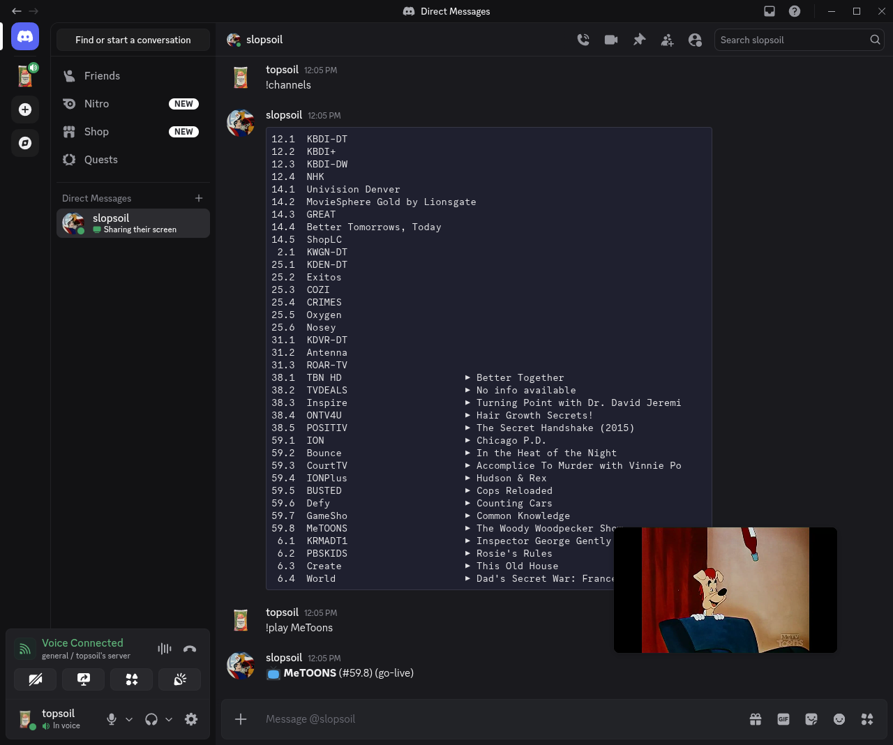
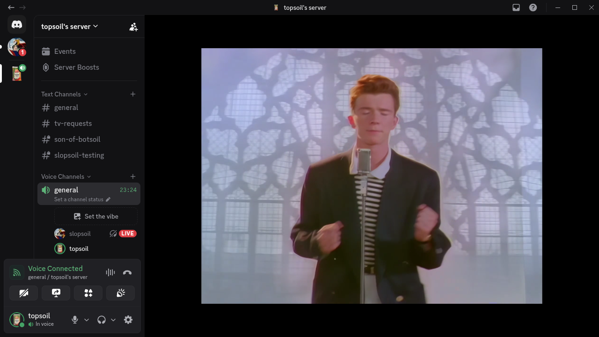

  
  [](https://www.buymeacoffee.com/devtopsoil)  
# Slopsoil - Stream from Jellyfin, YouTube, Tvheadend, or IPTV directly to Discord Voice Channels

**Slopsoil** is a Discord self-bot that streams live TV, IPTV playlists, YouTube videos, Jellyfin media, and any HTTP/HLS/RTSP stream directly into a Discord voice channel - as a screenshare that all server members can watch together.

Features include TVheadend integration, Jellyfin integration, M3U/IPTV playlist management with live EPG (now-playing), YouTube playback via yt-dlp, and hardware-accelerated H.264 encoding via VA-API or NVIDIA NVENC.

> **Disclaimer:**   
> Slopsoil is a self-bot. It runs on a real Discord user account, not a bot application.  
> Self-bots violate Discord's [Terms of Service](https://discord.com/terms).  
> Use it on an account you are willing to lose, and do not use it in a way that disrupts other users or servers.  
> The authors take no responsibility for account terminations or other consequences.

> **Keywords:** discord iptv bot, discord youtube stream, stream tv to discord, discord live stream bot, discord voice channel video, iptv discord, self-bot streaming, tvheadend discord, hls discord bot

---

## Table of Contents

- [Screenshots](#screenshots)
- [Features](#features)
- [How It Works](#how-it-works)
- [Requirements](#requirements)
- [Installation - Bare Metal](#installation--bare-metal)
- [Installation - Docker Compose](#installation--docker-compose)
- [Configuration](#configuration)
- [Commands](#commands)
- [Rebuilding the Docker Container](#rebuilding-the-docker-container)
- [Hardware Acceleration](#hardware-acceleration)
- [Running Tests](#running-tests)

---

## Screenshots

| Channel List | Stream Running |
|---|---|
|  |  |

---

## Features

- **YouTube & media streaming** - play any URL that yt-dlp supports (YouTube VODs, YouTube Live, Twitch VODs, etc.) directly into a voice channel; live streams are detected automatically and streamed without downloading
- **MJPEG / CGI stream support** - play `.cgi` video URLs (IP cameras, legacy streaming servers) and MJPEG-over-HTTP streams directly
- **IPTV / M3U playlist support** - add M3U sources by URL; channels are listed with live EPG now-playing info
- **TVheadend integration** - browse and play live TV channels from a TVheadend server; search the EPG by show title and schedule playback; showtimes are shown in the configured timezone
- **Jellyfin integration** - search and stream movies, series, and episodes from a Jellyfin media server; transcoding is offloaded to Jellyfin so the bot streams H.264/AAC with subtitles suppressed
- **Auto-leave on empty channel** - the bot automatically leaves and stops streaming when the last user leaves the voice channel
- **Go-live / screenshare delivery** - streams appear as a screenshare so all members in the channel can watch
- **H.264 hardware acceleration** - auto-detects NVIDIA NVENC, VA-API (Intel/AMD), or falls back to software encoding
- **Discord DAVE E2EE support** - correctly handles Discord's end-to-end encryption protocol for voice channels
- **Role-based access control** - admin, friend, viewer, and none tiers; friends list and guild membership are used automatically

---

## How It Works

slopsoil sends H.264 video and Opus audio directly over Discord's voice UDP protocol, appearing to other users as a screenshare (go-live stream). It patches `discord.py-self` at runtime to add video capability negotiation and implements the full RTP packetization pipeline including SPS/VUI rewriting, RFC 6184 FU-A fragmentation, and DAVE E2EE encryption.

For a detailed technical explanation of the streaming pipeline, the discord.py-self patches, and the esoteric protocol-level discoveries made while building this, see [STREAMING.md](STREAMING.md).

---

## Requirements

### Bare metal

| Requirement | Notes |
|---|---|
| Python 3.11+ | |
| FFmpeg | Fedora: `ffmpeg-free` (not RPM Fusion's `ffmpeg`). See [Hardware Acceleration](#hardware-acceleration). |
| libdave / dave.py | The official Discord DAVE E2EE C library; `dave.py` wraps it |
| A Discord account token | **Not** a bot token - slopsoil runs as a self-bot on a real user account |

### Docker

- Docker Engine 24+ and Docker Compose v2
- Optional: a VA-API GPU (`/dev/dri`) or NVIDIA GPU for hardware encoding

---

## Installation - Bare Metal

### 1. Clone the repository

```bash
git clone https://github.com/topsoil/slopsoil.git
cd slopsoil
```

### 2. Install FFmpeg

**Fedora / RHEL:**
```bash
sudo dnf install ffmpeg-free
```

**Ubuntu / Debian:**
```bash
sudo apt install ffmpeg
```

> **Important:** Do **not** use RPM Fusion's `ffmpeg` package on Fedora. It ships libx264, whose output causes Discord to drop the stream after one frame. Fedora's built-in `ffmpeg-free` package (libopenh264) is required. See [STREAMING.md](STREAMING.md) for the full explanation.

### 3. Install Python dependencies

```bash
python -m venv venv && source venv/bin/activate
pip install -r requirements.txt
```

This installs:
- `discord.py-self` - self-bot library with voice support
- `PyNaCl` - libsodium bindings for RTP encryption
- `python-dotenv` - `.env` file loading
- `davey` - stub package (replaced at runtime by the DAVE compatibility shim)
- `dave.py` - DisnakeDev's official libdave Python bindings (working DAVE/E2EE)
- `yt-dlp` - YouTube and media downloader

### 4. Configure the bot

Copy the example environment file and fill in your values:

```bash
cp .env.example .env
```

See [Configuration](#configuration) for details on each variable.

### 5. Run the bot

```bash
python3 bot.py
```

---

## Installation - Docker Compose

### 1. Clone the repository

```bash
git clone https://github.com/topsoil/slopsoil.git
cd slopsoil
```

### 2. Configure the bot

```bash
cp .env.example .env
```

Edit `.env` with your Discord token and other settings. See [Configuration](#configuration).

### 3. Build and start

```bash
docker compose up -d --build
```

The container will build automatically on first run. IPTV source data is persisted in a named Docker volume (`slopsoil-data`) so your M3U sources survive container restarts and updates.

### 4. View logs

```bash
docker compose logs -f
```

---

## Configuration

All configuration is done via environment variables in `.env`:

```env
# Required - your Discord account token (not a bot token)
DISCORD_TOKEN=your_token_here

# Comma-separated Discord user IDs that can control the bot
ALLOWED_USER_IDS=123456789012345678,987654321098765432

# Optional - TVheadend server (all three must be set to enable TV commands)
TVHEADEND_URL=http://192.168.1.100:9981
TVHEADEND_USER=admin
TVHEADEND_PASS=yourpassword

# Optional - IANA timezone for showtimes displayed by !search (e.g. America/New_York)
# If unset, the system timezone of the machine running the bot is used.
TIMEZONE=

# Optional - Jellyfin server (both must be set to enable Jellyfin commands)
JELLYFIN_URL=http://192.168.1.100:8096
JELLYFIN_API_KEY=your_api_key_here
```

| Variable | Required | Description |
|---|---|---|
| `DISCORD_TOKEN` | Yes | Your Discord account token |
| `ALLOWED_USER_IDS` | Yes | Comma-separated user IDs with admin access |
| `TVHEADEND_URL` | No | Base URL of your TVheadend server |
| `TVHEADEND_USER` | No | TVheadend username |
| `TVHEADEND_PASS` | No | TVheadend password |
| `TIMEZONE` | No | [IANA timezone name](https://en.wikipedia.org/wiki/List_of_tz_database_time_zones) for `!search` showtimes (e.g. `America/Chicago`). Defaults to the system timezone. |
| `JELLYFIN_URL` | No | Base URL of your Jellyfin server |
| `JELLYFIN_API_KEY` | No | Jellyfin API key (generate in Dashboard → API Keys) |

TVheadend is optional. If any of the three `TVHEADEND_*` variables are missing, the `!channels`, `!search`, and TVheadend-backed `!play` commands are not loaded.

### Finding your Discord token

1. Open Discord in a browser
2. Open DevTools (F12) → Network tab
3. Filter for requests to `discord.com/api`
4. Look for the `Authorization` header on any request - that value is your token

> **Security:** Keep your token private. Anyone with your token can access your Discord account.

---

## Commands

### Voice

| Command | Role | Description |
|---|---|---|
| `!join` | Friend | Join your current voice channel |
| `!leave` | Friend | Leave the voice channel |
| `!stop` | Friend | Stop the active stream |

### Streaming

| Command | Role | Description |
|---|---|---|
| `!play <channel number>` | Friend | Play a TVheadend channel by number |
| `!play <channel name>` | Friend | Play a channel by name (case-insensitive substring match; searches TVheadend and IPTV) |
| `!play <URL>` | Friend | Play any URL — YouTube VODs, YouTube Live streams, direct HLS/HTTP/RTSP streams, `.cgi` MJPEG feeds, etc. Live streams are detected automatically and streamed without downloading. |
| `!channels` | Viewer | List all available channels with live now-playing info (paginated) |
| `!search <show title>` | Friend | Search EPG for a show — plays immediately if airing now, or schedules for upcoming airtime. Showtimes are shown in the `TIMEZONE` configured in `.env`. |

### Jellyfin

| Command | Role | Description |
|---|---|---|
| `!media <title>` | Friend | Search Jellyfin for a movie or series and stream it into your voice channel. A single movie match plays immediately. For series, the bot walks you through season → episode selection. Accepts an optional `sXXeYY` suffix (e.g. `!media breaking bad s03e05`) to jump directly to a specific episode. Transcoding is handled server-side by Jellyfin; subtitles are always suppressed. |

### IPTV Source Management

| Command | Role | Description |
|---|---|---|
| `!add-source <name> <url>` | Admin | Add an M3U playlist source |
| `!sources` | Admin | List all sources with enabled/disabled status |
| `!sources enable <name>` | Admin | Enable a source |
| `!sources disable <name>` | Admin | Disable a source |
| `!delete-source` | Admin | Interactively delete a source |

### General

| Command | Role | Description |
|---|---|---|
| `!ping` | Any | Check if the bot is responding |
| `!help` | Any | List available commands |

### Permission tiers

| Role | Who qualifies |
|---|---|
| **Admin** | User IDs listed in `ALLOWED_USER_IDS` |
| **Friend** | Users on the bot account's friends list |
| **Viewer** | Members of any guild the bot account is in |
| **None** | Everyone else |

---

## Rebuilding the Docker Container

When you pull new changes to the project, rebuild the container image:

```bash
# Pull latest changes
git pull

# Rebuild the image and restart the container
docker compose up -d --build
```

If you only changed `.env` (no code changes), a restart is enough - no rebuild needed:

```bash
docker compose restart
```

To completely reset the container and its image (does **not** delete IPTV source data, which lives in the volume):

```bash
docker compose down
docker compose up -d --build
```

To also wipe the IPTV source data volume:

```bash
docker compose down -v
docker compose up -d --build
```

---

## Hardware Acceleration

slopsoil auto-detects the best available H.264 encoder in this priority order:

| Encoder | Type | Requires |
|---|---|---|
| `h264_nvenc` | NVIDIA GPU | NVIDIA driver + `nvidia-container-toolkit` |
| `h264_vaapi` | VA-API (Intel/AMD) | `/dev/dri` device |
| `libopenh264` | Cisco software | Included in `ffmpeg-free` |
| `libx264` | Software (fallback) | **Not used** in Docker (see below) |

### Enabling VA-API in Docker

Uncomment the `devices` section in `docker-compose.yml`:

```yaml
devices:
  - /dev/dri:/dev/dri
```

Then rebuild:

```bash
docker compose up -d --build
```

### Enabling NVIDIA NVENC in Docker

Install [nvidia-container-toolkit](https://docs.nvidia.com/datacenter/cloud-native/container-toolkit/install-guide.html), then add to `docker-compose.yml`:

```yaml
deploy:
  resources:
    reservations:
      devices:
        - driver: nvidia
          count: 1
          capabilities: [gpu]
```

### Why libx264 isn't used in Docker

The Docker image is based on Fedora and uses `ffmpeg-free`. This package does not include `libx264` (which requires a separate RPM Fusion repository and a different FFmpeg build). More importantly, `libx264`-encoded streams cause Discord to silently drop the stream after the very first frame. `libopenh264` and the hardware encoders do not have this problem. See [STREAMING.md](STREAMING.md) for the technical details.

---

## Running Tests

The test suite covers the permissions system, video compat patches, voice utilities, and the DAVE shim logic.

### Install test dependencies

```bash
source venv/bin/activate
pip install pytest pytest-asyncio pytest-mock
```

Or without activating the venv:

```bash
venv/bin/pip install pytest pytest-asyncio pytest-mock
```

### Run all tests

```bash
venv/bin/pytest
```

### Useful flags

```bash
# Verbose output with print statements
venv/bin/pytest -v -s

# Stop on first failure
venv/bin/pytest -x

# Run a specific file
venv/bin/pytest tests/test_permissions.py

# With coverage report
venv/bin/pip install pytest-cov
venv/bin/pytest --cov --cov-report=term-missing
```
